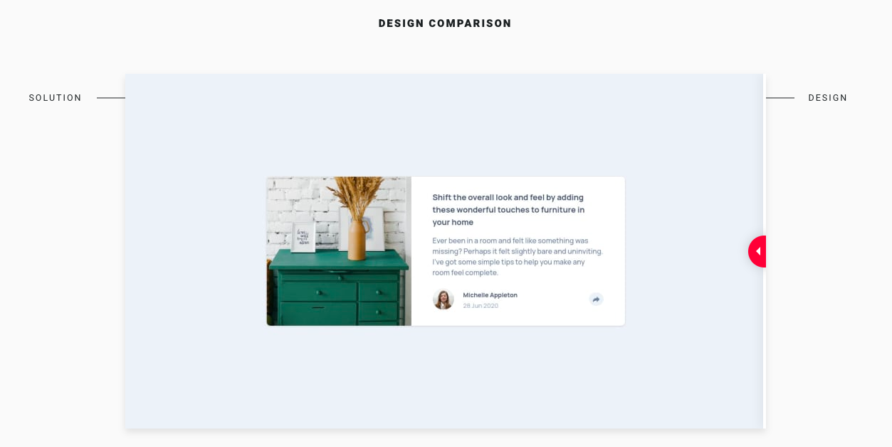

# Frontend Mentor - Article preview component solution

This is a solution to the [Article preview component challenge on Frontend Mentor](https://www.frontendmentor.io/challenges/article-preview-component-dYBN_pYFT). Frontend Mentor challenges help you improve your coding skills by building realistic projects. 

## Table of contents

- [Frontend Mentor - Article preview component solution](#frontend-mentor---article-preview-component-solution)
  - [Table of contents](#table-of-contents)
  - [Overview](#overview)
    - [The challenge](#the-challenge)
    - [Screenshot](#screenshot)
    - [Links](#links)
  - [Built with](#built-with)
  - [Project Highlight](#project-highlight)
  - [Running the project](#running-the-project)
  - [Deploying the project](#deploying-the-project)
  - [Author](#author)

## Overview

### The challenge

Users should be able to:

- View the optimal layout for the component depending on their device's screen size
- See the social media share links when they click the share icon

### Screenshot

### Links

- Solution URL: [https://github.com/tiagobw/article-preview-component](https://github.com/tiagobw/article-preview-component)
- Live Site URL: [https://article-preview-component-frontendmentor-challenge.netlify.app/](https://article-preview-component-frontendmentor-challenge.netlify.app/)

## Built with

- React
- TypeScript
- Semantic HTML5 markup
- Mobile-first workflow
- CSS Grid and Flexbox
- Tailwind CSS

## Project Highlight

I used a combination of React ref + useEffect + "mousedown" event listener to detect clicks outside the Social Media share links Popup.

So whenever you open the popup by clicking the share icon, you can click outside to close it.

## Running the project

`npm start` or `yarn start`

Runs the app in development mode. 
Open [http://localhost:3000](http://localhost:3000) to view it in the browser.

## Deploying the project

`npm run build` or `yarn build`

Builds the app for production to the `build` folder. 
It correctly bundles React in production mode and optimizes the build for the best performance.

The build is minified and the filenames include the hashes. 

The app is ready to be deployed.

## Author

- Frontend Mentor - [@tiagobw](https://www.frontendmentor.io/profile/tiagobw)
